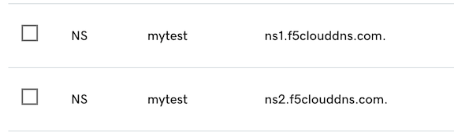

# Configuring auto cert in XC

Subdomain Delegation Example - uses GoDaddy
1. Add subdomain to be delegated as a primary domain in XC DNS.
* Make sure to check the box for: "Allow Application Load Balancer Managed Records" under the Primary DNS Configuration options.
* In this example the test subdomain to be delegated is: **mytest**.myfselab.us

2. Add NS servers with a delegation to **mytest** to customer managed DNS Servers (In this example the DNS provider is GoDaddy.

3. Create LB object with auto-cert enabled. EX: site1.mytest.myfselab.us

