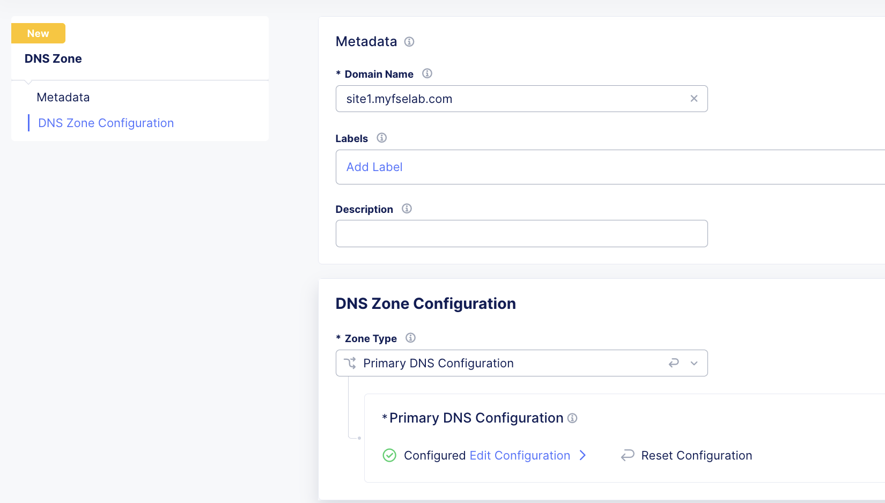
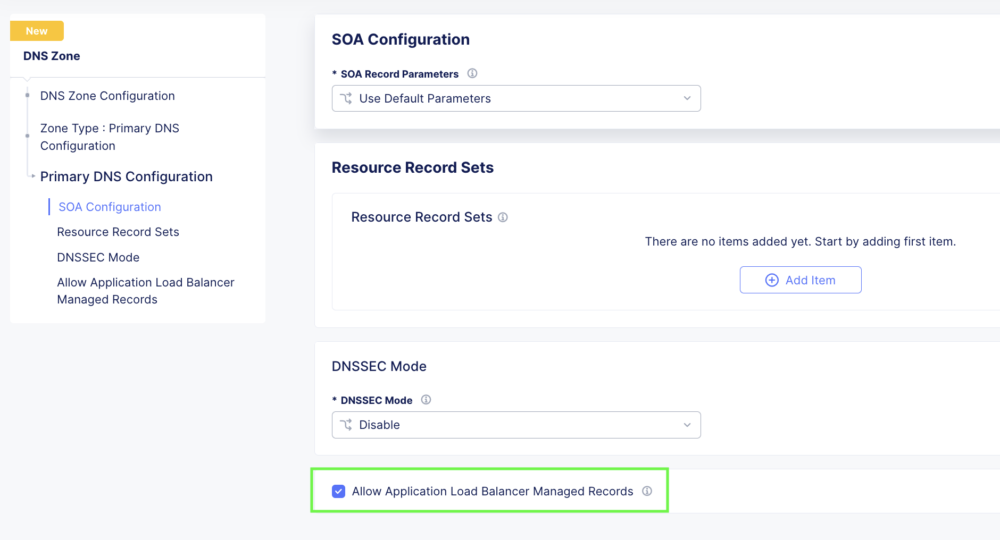
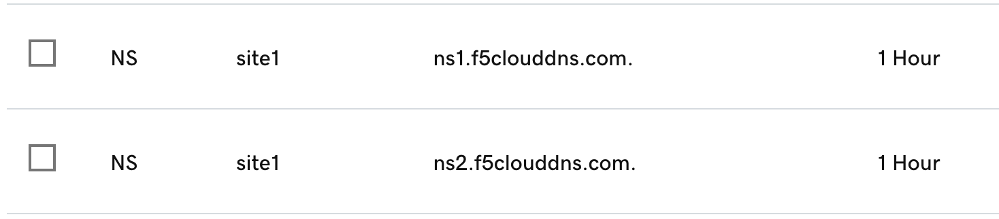
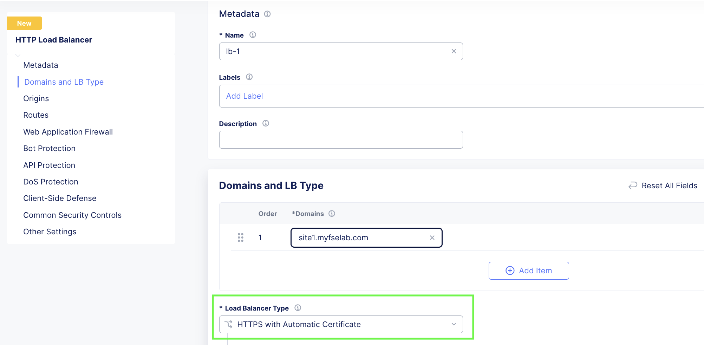
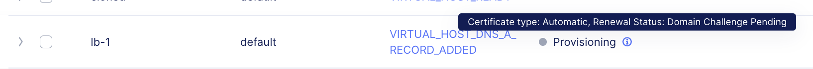
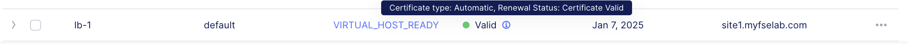

## Overview

* Godaddy DNS is authoritative for myfselab.com.
* No records exist in Godaddy DNS for site1.myfselab.com

**Note:** Auto Certificate supported in this configuration. 

1.  Add subdomain to be delegated **site1.myfselab.com** as a primary domain in XC DNS.

  

* Make sure to check the box for: "Allow Application Load Balancer Managed Records" under the Primary DNS Configuration options.

    

2. In GoDaddy, add F5 Cloud DNS Server NS records with a delegation to **site1**.

    

3. Create LB object with auto-cert enabled. EX: site1.mytest.myfselab.us

    

4. Verify - The cert generation process can take a few minutes. You will see it in a pending state. Click on the "i" for more info. 

    

5. Success

    

