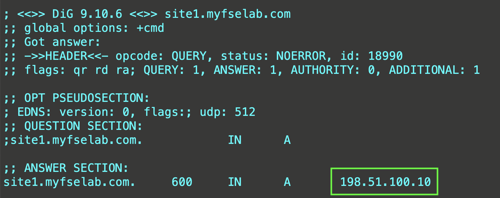
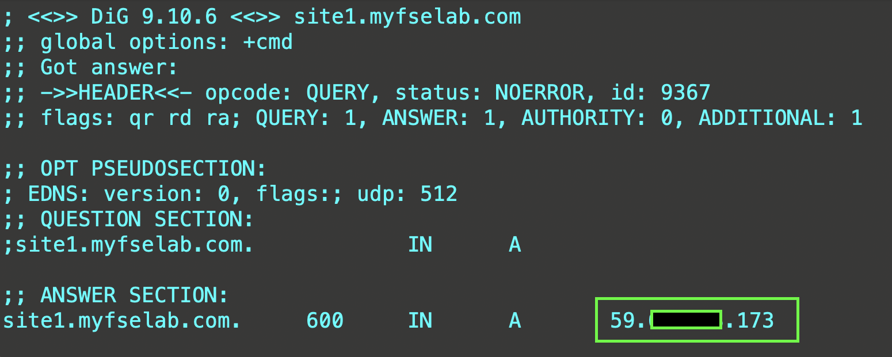
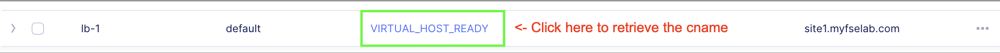
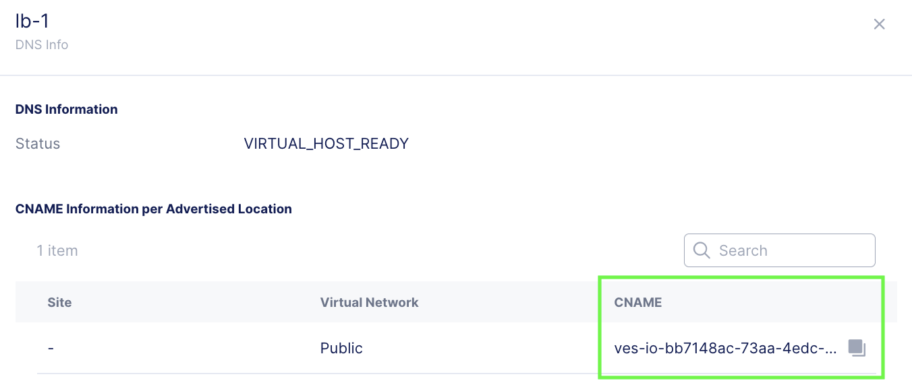
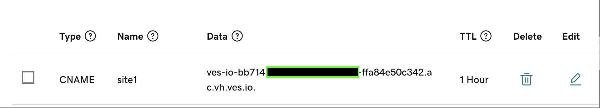
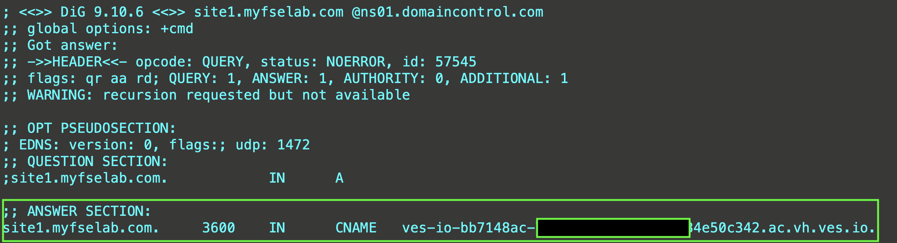

# Configuring DNS Delegation to XC. 

There are 3 options for getting clients resolved appropriately to the XC Cloud Load Balancer.

1. "A" record Modification
2. CNAME Delegation
3. Subdomain Delegation

In all three examples below, Godaddy is playing the role of both Name Registrar and Primary DNS. 

## "A" Record Modification Example
"A" record modification is quick and straightforward to configure. Similar to setting a host file on your local system. 

**Note:** Auto Certificate management not supported in this configuration. BYOC.  

### Overview

* Godaddy DNS is authoritative for myfselab.com. 
* A record exists in Godaddy DNS for site1.myfselab.com 

    

1. Create an XC-LB. Example domain is: **"site1.myfselab.com"**
2. Retrieve XC public IP from LB JSON (get_spec->DNS Info->IP Address)
3. Modify "A" record in GoDaddy to point to XC IP
4. Verify

    

########################################################################

## CNAME Delegation Example 

### Overview

* Godaddy DNS is authoritative for myfselab.com. 
* A record exists in Godaddy DNS for site1.myfselab.com 

1. Create an XC-LB
2. Retrieve XC LB CNAME

    

3. Copy the CNAME

    

4. In Godaddy, delete the existing "A" record for **site1.rexample.com** and create a CNAME record pointing site1 to the XC CNAME. 

    

5. Verify

    

## Subdomain Delegation Example 

  * Add subdomain to be delegated as a primary domain in XC DNS.
    * Make sure to check the box for: "Allow Application Load Balancer Managed Records" under the Primary DNS Configuration options.
  * In this example the test subdomain to be delegated is: **mytest**.myfselab.us

2. Add NS servers with a delegation to **mytest** to customer managed DNS Servers (In this example the DNS provider is GoDaddy.

    

3. Create LB object with auto-cert enabled. EX: site1.mytest.myfselab.us

