# Deploying Vulnerable Web Apps in Azure With Automated Expiration Cleanup

## Overview

This guide helps you deploy intentionally vulnerable web applications (such as OWASP Juice Shop, Hackazon, DVWA, etc.) into Azure **safely**, **locked down**, and with **automatic cleanup** using an Azure Logic App.

This prevents:

- Accidental exposure of vulnerable apps  
- Lingering cloud resources that continue to incur costs  

The Logic App will **delete resources when their expiration tag is reached**, ensuring that your lab environments remain temporary and controlled.  
**Logic App Cost:** ~$0.001 – $0.02 per month.

---

# Prerequisites

Before deploying any vulnerable applications, configure:

1. **A Resource Group** for deployment  
2. **A Logic App** with Managed Identity enabled  
3. **RBAC permissions** so the Logic App can delete expired resources  
4. **Tagging standards** for consistent cleanup  

---

# Step A — Create the Resource Group

1. Go to **Resource Groups → Create**
2. Name: `rg-vuln-web-lab`
3. Region: Your preferred region
4. Click **Create**

---

# Step A.1 — Create the Logic App

1. Go to **Azure Portal → Logic Apps → Create**
2. Plan Type: **Consumption**
3. Resource Group: `rg-vuln-web-lab`
4. Name: `vuln-lab-expiration-cleanup`
5. Region: Same as RG
6. Click **Review + Create → Create**

---

# Step A.2 — Enable Managed Identity (Required)

1. Open the Logic App  
2. Left menu → **Identity**  
3. Under **System Assigned**, toggle **On**  
4. Click **Save**


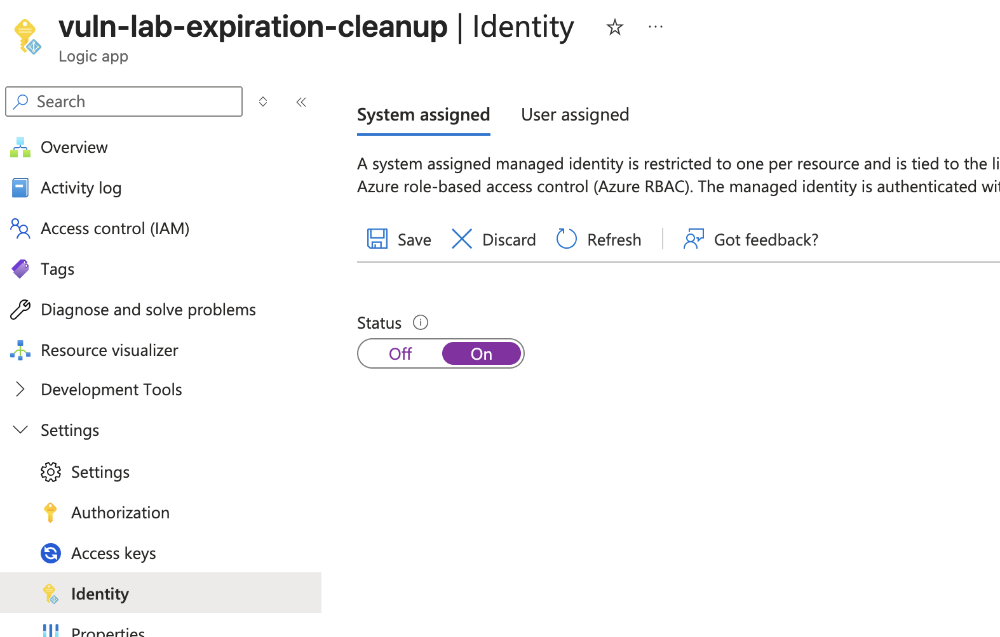


Now the Logic App has:

- A system-assigned Managed Identity  
- An Object ID (GUID)

---

# Step A.3 — Grant RBAC Permissions on the Resource Group

The Logic App needs **Contributor** rights to delete expired resources.

1. Go to: **Resource groups → rg-vuln-web-lab**  
2. Left menu → **Access Control (IAM)**  
3. Click **Add → Add role assignment**  
4. Select:  
   - **Role:** Privileged administrator roles -> Contributor  


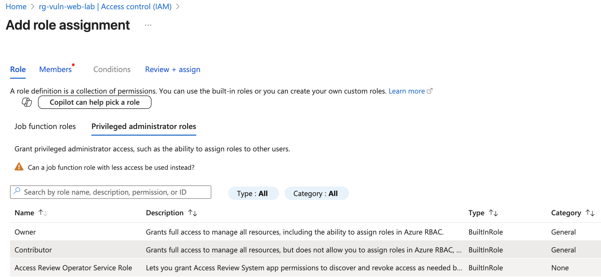

5. **Assign access to:** Managed Identity and click **"+ Select members"**

6. Select member:  
   - **Type:** Logic App  
   - **Name:** `vuln-lab-expiration-cleanup`  


The role assignment should look look this now: 

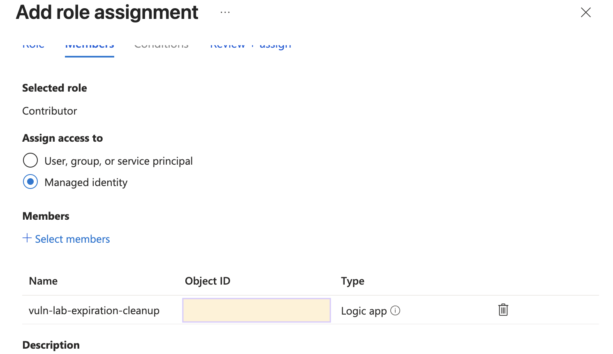

7. Click **Review + assign** and then **Review + assign**

The Logic App now has permissions.

---

# Step A.4 — Build the Logic App Workflow

Open the Logic App and then **Logic App Designer** by clicking **"Edit"** and follow these steps.

---
 
## 1. Trigger: **Schedule → Recurrence**

Configure:

- **Frequency:** Day  
- **Interval:** 1  
- **At these hours:** 12  

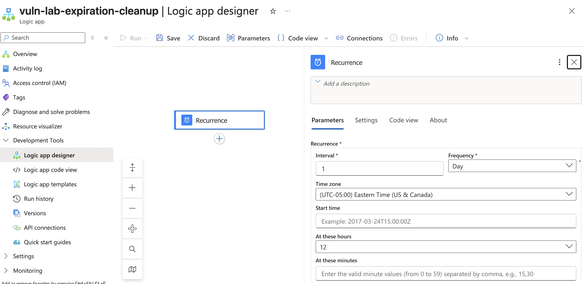

Close the pane and click **Save**. 

---

## 2. Add Action: **List resources (Resource Group)**

Under the **Recurrence** trigger, click the blue **+** → **Add an action**.

Search for:

**List resources (Resource Group)**  
(from the Azure Resource Manager connector)

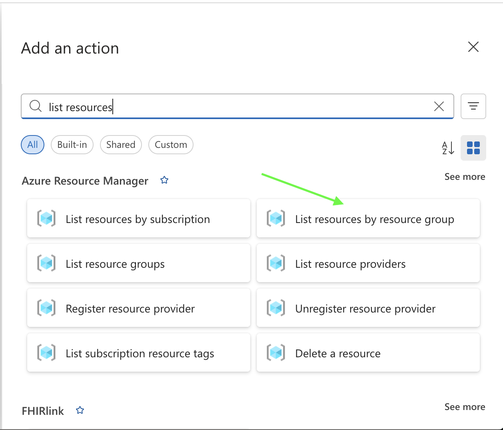

When you click into the connector for the first time, Azure will prompt you to create a connection.

---

## 3. Create the ARM Connection (Managed Identity)

When the **Create connection** panel appears:

Choose:

- **Authentication:** Managed Identity  
- **Connection name:** default value
- **Managed Identity:** `System-assigned managed identity`  

**Create New**

Choose your:

- **Subscription:** Your subscription  
- **Resource Group:** `rg-vuln-web-lab`


Close the panel and click **Save**.

This establishes the ARM connection used for all future ARM operations.


## 4. Add Action **For Each**

Loop over the `value` array from the **List resources by resource group** action.

1. Click the blue **+** under **List resources by resource group**  
2. Choose **Add an action → Built-in → Control → For each**  
3. In **“Select an output from previous steps”**, click **Dynamic content** and pick **`value`** from the *List resources by resource group* output  
   - Logic Apps will internally set this to:  
     `@body('List_resources_by_resource_group')?['value']`
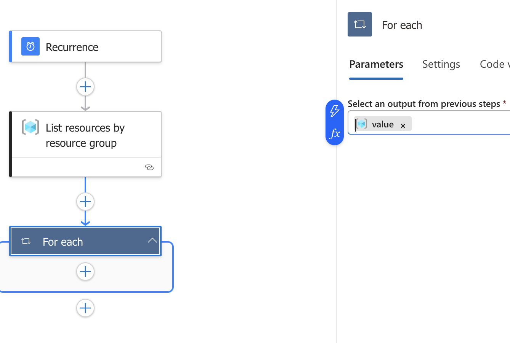

Close the panel and click **Save**.

---

## 5. Condition: Check `expireOn` tag (null-safe)

1. From within the **For each** pane, click the blue **+** → **Add an action**  
2. Search for **Condition** and add it  


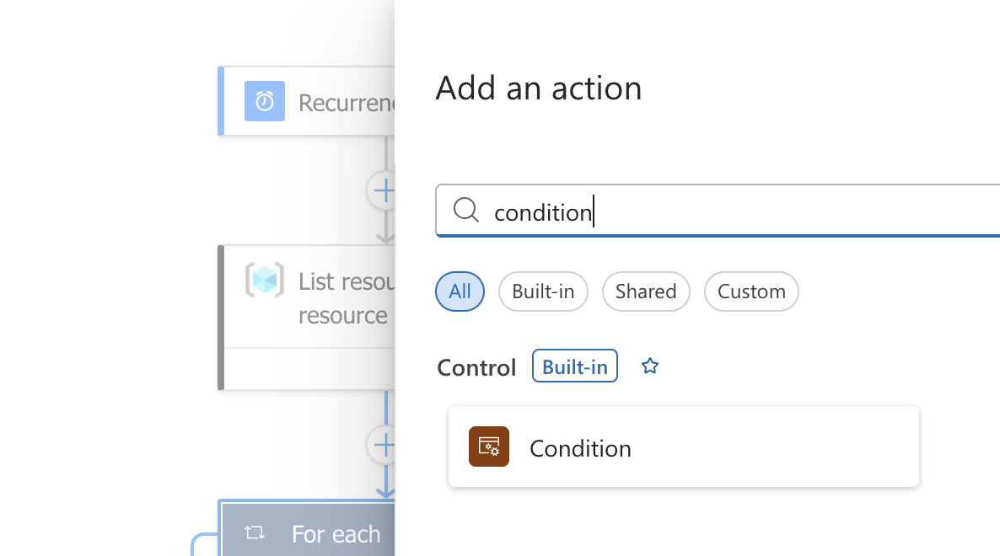

Now switch the condition to an **expression** that safely handles resources with no tags:

In the first **“Choose a value”** box, click the blue fx icon.

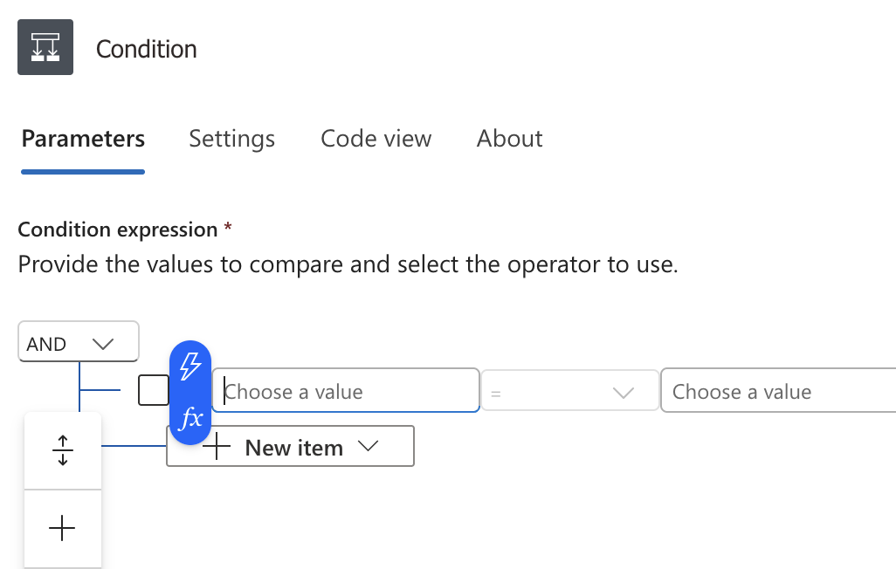

In the expression editor that pops up, paste: 

```
lessOrEquals(
  coalesce(item()?['tags']?['expireOn'], '9999-12-31T23:59:59Z'),
  utcNow()
)
```
In the middle box set it to **=**.

In the right “Choose a value” box, click the blue fx icon again.

In the expression editor, just enter:

```
true
```
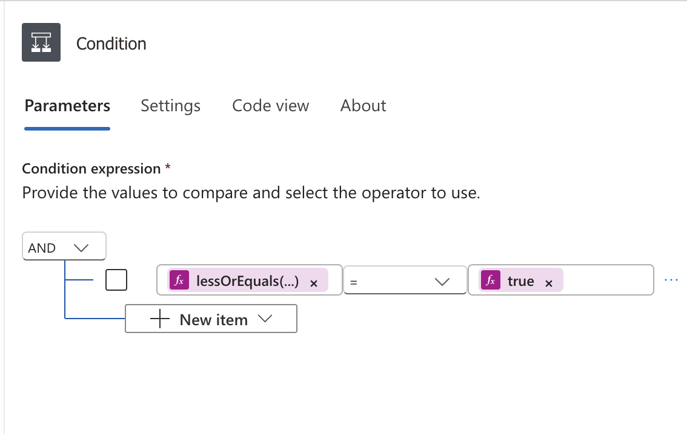

3. Close the pane and click **Save**. 

This logic means:

If expireOn is missing, we treat it as 9999-12-31T23:59:59Z → the comparison is false → resource is not deleted

If expireOn exists and is in the past, the condition is true → resource will be deleted

---

## 6. If TRUE → Delete Resource

Inside the green **True** branch of the Condition:

1. Click the blue **+** → **Add an action**  
2. Search for **Delete a resource**  
3. Select: **Azure Resource Manager → Delete a resource**

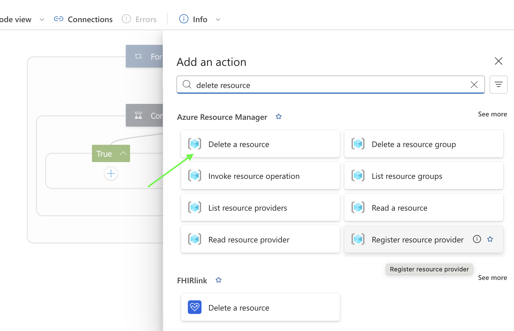

Action:
**Azure Resource Manager → Delete Resource**

- **Subscription:** Your Subscription 
- **Resource Group:** rg-vuln-web-lab  
- **Resource Provider:** Enter Custom Value -> Expression -> 
```
item()?['type']

```
- **Short Resource ID:** Expression -> 
```
item()?['name']

```
- **Client API Version:** 2021-04-01

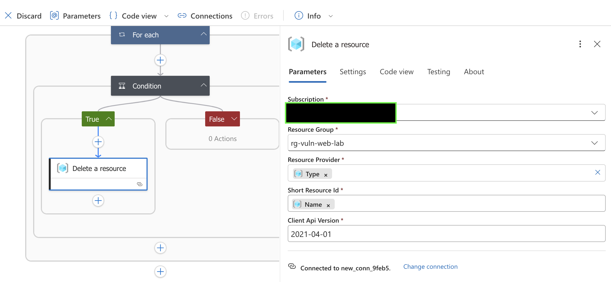

Click **Save**

This tells Azure to delete the specific resource (by type and name) inside the `rg-vuln-web-lab` Resource Group whenever the condition evaluates to **true**.

## 7. False Branch (Do Nothing)

Leave the **False** branch of the Condition empty.

- If a resource has no `expireOn` tag, or  
- Its `expireOn` value is in the **future**,  

then the condition expression will evaluate to **false**, and the Logic App will **skip** that resource without taking any action.

---

## 8. Quick Logic App Functionaility Verification 

Public IP Address (Ultra-fast test)

### Steps:
1. Azure Portal → **Create → Public IP Address**

**Resource Group:** rg-vuln-web-lab 
**Name:** mytestip1
**DNS Name Label:** mytestip1

2. Add tags:

expireOn = 2024-01-01T00:00:00Z
owner = test
demo = test-delete

3. Run the Logic App  
4. The Public IP should be removed immediately

---

These are the best resources for safely testing your Logic App cleanup workflow before using it on larger deployments.

---


# Tagging Standard for All Deployments

| Tag Key       | Purpose |
|---------------|---------|
| **expireOn**  | Cleanup timestamp (UTC) |
| **owner**     | Lab owner |
| **demo**      | Application identifier |

### Example Tags

```
expireOn = 2025-11-25T23:59:00Z
owner    = mike
demo     = juiceshop-lab
```

---

# Deployment Options for Juice Shop

Deploy Juice Shop using one of three methods:

1. **Azure App Service** (recommended)
2. **Azure VM + Docker**
3. **Azure Container Instances (ACI)**

Each requires tagging + access control.

---

# Option 1 — Azure App Service (Recommended)

### Recommended Tags
```
expireOn = 2025-11-25T23:59:00Z
demo     = juice-appservice
```

## Deploy

1. Go to **App Services → Create Web App**
2. Publish: **Docker Container**
3. OS: **Linux**
4. Plan: **B1**
5. Image: `bkimminich/juice-shop:latest`

Verify:

```
https://juiceshop-lab-<unique>.azurewebsites.net
```

---

## Lock It Down

Navigate to:

**App → Networking → Access Restrictions**

Add:

1. allow-my-ip  
2. allow-scanner-ips (optional)  
3. deny-all  

---

## Add Expiration Tags

```
expireOn = <UTC timestamp>
owner    = mike
demo     = juice-appservice
```

---

# Option 2 — Azure VM (Docker)

### Recommended Tags
```
expireOn = 2025-11-25T23:59:00Z
demo     = juice-vm
```

## Create VM

- OS: Ubuntu 22.04  
- Size: B2s  
- NSG: Allow your IP only  

---

## Install Docker

```
sudo apt-get update
sudo apt-get install -y docker.io
sudo systemctl enable docker
sudo systemctl start docker
sudo usermod -aG docker $USER
```

---

## Run Juice Shop

```
sudo docker run -d --name juiceshop -p 80:3000 bkimminich/juice-shop
```

Browse:

```
http://<VM_PUBLIC_IP>/
```

---

## Add Expiration Tags

```
expireOn = <UTC timestamp>
owner    = mike
demo     = juice-vm
```

---

# Option 3 — Azure Container Instances (ACI)

### Recommended Tags
```
expireOn = 2025-11-25T23:59:00Z
demo     = juice-aci
```

## Create ACI

- Image: `bkimminich/juice-shop`
- CPU: 1 vCPU  
- RAM: 2 GB  
- Port: 3000  

URL:

```
https://juiceshop-aci-<unique>.<region>.azurecontainer.io:3000
```

---

## Lock Down

Use:

- ACI firewall  
- or VNet + NSG

---

## Add Expiration Tags

```
expireOn = <UTC timestamp>
owner    = mike
demo     = juice-aci
```

---

# Cleanup Happens Automatically

Once `expireOn` is reached:

- Logic App detects expired resources  
- Deletes them  
- Optional notifications  

Your environment stays secure, temporary, and cost-efficient.

