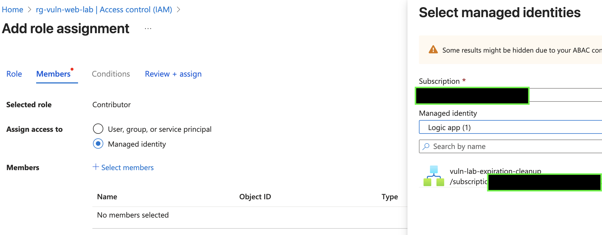
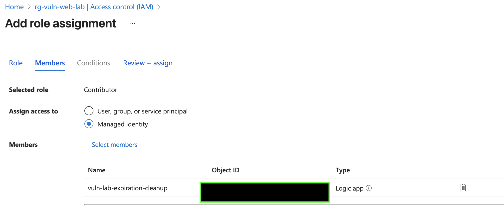

# Deploying Vulnerable Web Apps in Azure With Automated Expiration Cleanup

## Overview

This guide helps you deploy intentionally vulnerable web applications (such as OWASP Juice Shop, Hackazon, DVWA, etc.) into Azure **safely**, **locked down**, and with **automatic cleanup** using an Azure Logic App.

This prevents:

- Accidental exposure of vulnerable apps  
- Lingering cloud resources that continue to incur costs  

The Logic App will **delete resources when their expiration tag is reached**, ensuring that your lab environments remain temporary and controlled.  
**Cost:** ~$0.001 – $0.02 per month.

---

# Prerequisites

Before deploying any vulnerable applications, configure:

1. **A Resource Group** for deployment  
2. **A Logic App** with Managed Identity enabled  
3. **RBAC permissions** so the Logic App can delete expired resources  
4. **Tagging standards** for consistent cleanup  

---

# Step A — Create the Resource Group

1. Go to **Resource Groups → Create**
2. Name: `rg-vuln-web-lab`
3. Region: Your preferred region
4. Click **Create**

---

# Step A.1 — Create the Logic App

1. Go to **Azure Portal → Logic Apps → Create**
2. Plan Type: **Consumption**
3. Resource Group: `rg-vuln-web-lab`
4. Name: `vuln-lab-expiration-cleanup`
5. Region: Same as RG
6. Click **Review + Create → Create**

---

# Step A.2 — Enable Managed Identity (Required)

1. Open the Logic App  
2. Left menu → **Identity**  
3. Under **System Assigned**, toggle **On**  
4. Click **Save**


Now the Logic App has:

- A system-assigned Managed Identity  
- An Object ID (GUID)

---

# Step A.3 — Grant RBAC Permissions on the Resource Group

The Logic App needs **Contributor** rights to delete expired resources.

1. Go to: **Resource groups → rg-vuln-web-lab**  
2. Left menu → **Access Control (IAM)**  
3. Click **Add → Add role assignment**  
4. Select:  
   - **Role:** Contributor  
   - **Assign access to:** Managed Identity  




5. Select member:  
   - **Type:** Logic App  
   - **Name:** `vuln-lab-expiration-cleanup`  



6. Click **Save**

The Logic App now has permissions.

---

# Step A.4 — Build the Logic App Workflow

Open **Logic App Designer** and follow these steps.

---

## 1. Trigger: **Schedule → Recurrence**

Configure:

- **Frequency:** Day  
- **Interval:** 1  


---

## 2. Add Action: **List Resources (By Resource Group)**

Action:

**Azure Resource Manager → List resources (Resource Group)**


This retrieves all resources in `rg-vuln-web-lab`.

---

## 3. Create ARM Connection Using Managed Identity

Select:

- **Authentication:** Managed identity  
- **Managed Identity:** `vuln-lab-expiration-cleanup (System-assigned)`  
- **Subscription:** Your subscription  
- **Resource Group:** `rg-vuln-web-lab`


---

## 4. Add **For Each**

Loop over the `value` array from the List Resources action.

---

## 5. Condition: Check `expireOn` tag

Expression:

```
@if(lessOrEquals(item()?['tags']?['expireOn'], utcNow()), true, false)
```

---

## 6. If TRUE → Delete Resource

Action:

**Azure Resource Manager → Delete Resource**

Use:

```
item()?['id']
```

---

## 7. (Optional) Notifications

You may add:

- Email  
- Teams message  
- Webhook  

---

# Tagging Standard for All Deployments

| Tag Key       | Purpose |
|---------------|---------|
| **expireOn**  | Cleanup timestamp (UTC) |
| **owner**     | Lab owner |
| **demo**      | Application identifier |

### Example Tags

```
expireOn = 2025-11-25T23:59:00Z
owner    = mike
demo     = juiceshop-lab
```

---

# Deployment Options for Juice Shop

Deploy Juice Shop using one of three methods:

1. **Azure App Service** (recommended)
2. **Azure VM + Docker**
3. **Azure Container Instances (ACI)**

Each requires tagging + access control.

---

# Option 1 — Azure App Service (Recommended)

### Recommended Tags
```
expireOn = 2025-11-25T23:59:00Z
demo     = juice-appservice
```

## Deploy

1. Go to **App Services → Create Web App**
2. Publish: **Docker Container**
3. OS: **Linux**
4. Plan: **B1**
5. Image: `bkimminich/juice-shop:latest`

Verify:

```
https://juiceshop-lab-<unique>.azurewebsites.net
```

---

## Lock It Down

Navigate to:

**App → Networking → Access Restrictions**

Add:

1. allow-my-ip  
2. allow-scanner-ips (optional)  
3. deny-all  

---

## Add Expiration Tags

```
expireOn = <UTC timestamp>
owner    = mike
demo     = juice-appservice
```

---

# Option 2 — Azure VM (Docker)

### Recommended Tags
```
expireOn = 2025-11-25T23:59:00Z
demo     = juice-vm
```

## Create VM

- OS: Ubuntu 22.04  
- Size: B2s  
- NSG: Allow your IP only  

---

## Install Docker

```
sudo apt-get update
sudo apt-get install -y docker.io
sudo systemctl enable docker
sudo systemctl start docker
sudo usermod -aG docker $USER
```

---

## Run Juice Shop

```
sudo docker run -d --name juiceshop -p 80:3000 bkimminich/juice-shop
```

Browse:

```
http://<VM_PUBLIC_IP>/
```

---

## Add Expiration Tags

```
expireOn = <UTC timestamp>
owner    = mike
demo     = juice-vm
```

---

# Option 3 — Azure Container Instances (ACI)

### Recommended Tags
```
expireOn = 2025-11-25T23:59:00Z
demo     = juice-aci
```

## Create ACI

- Image: `bkimminich/juice-shop`
- CPU: 1 vCPU  
- RAM: 2 GB  
- Port: 3000  

URL:

```
https://juiceshop-aci-<unique>.<region>.azurecontainer.io:3000
```

---

## Lock Down

Use:

- ACI firewall  
- or VNet + NSG

---

## Add Expiration Tags

```
expireOn = <UTC timestamp>
owner    = mike
demo     = juice-aci
```

---

# Cleanup Happens Automatically

Once `expireOn` is reached:

- Logic App detects expired resources  
- Deletes them  
- Optional notifications  

Your environment stays secure, temporary, and cost-efficient.

